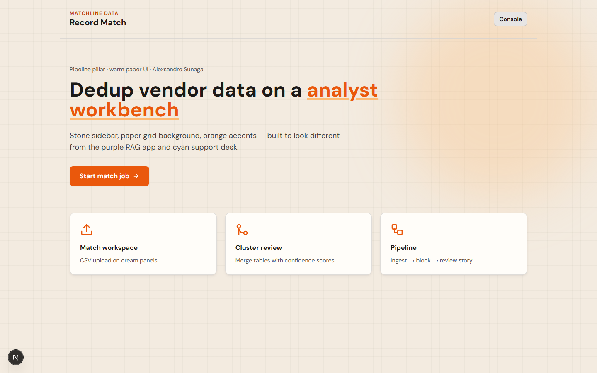
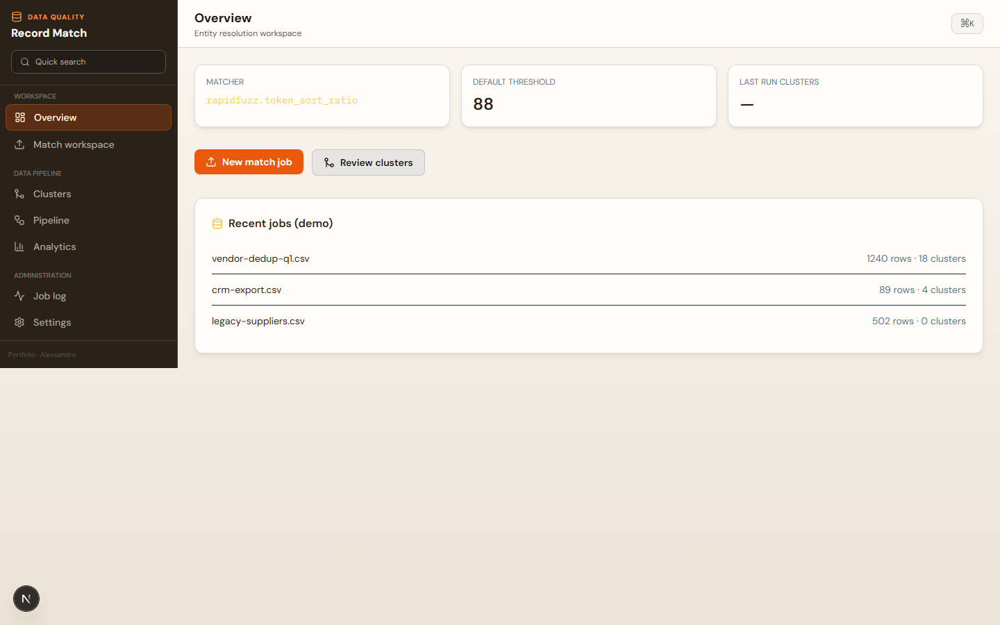
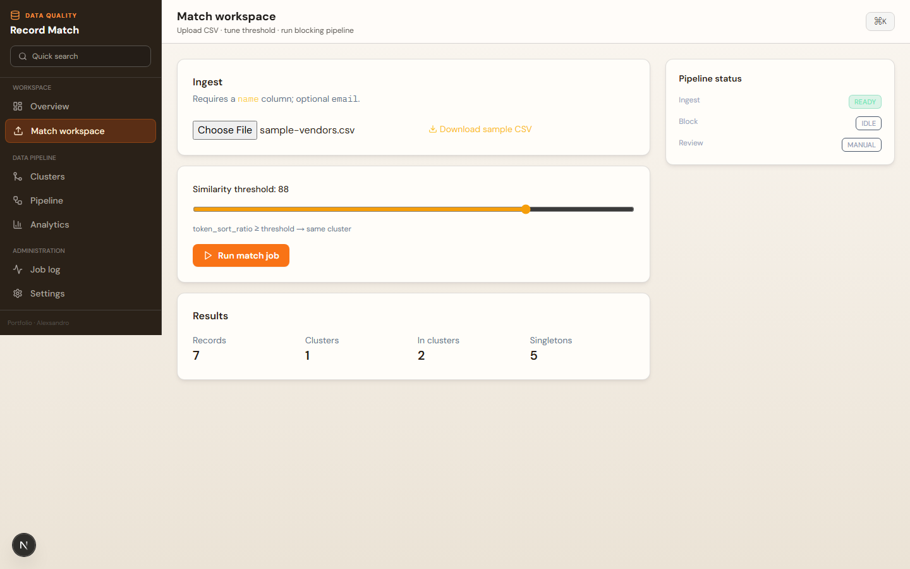
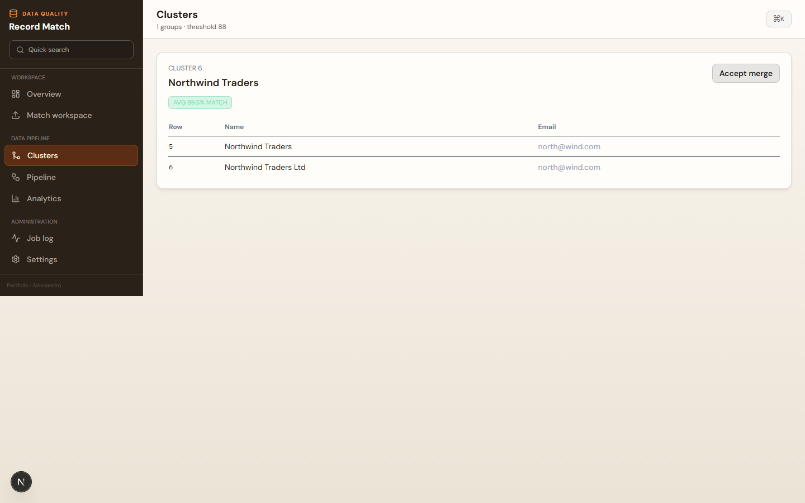

# Matchline

## Demo

[](docs/demo/demo.mp4)

The video walks through the landing page, dashboard and match workspace: it uploads `data/sample-vendors.csv`, lowers the threshold, runs the job and reviews the resulting cluster. [Watch the MP4](docs/demo/demo.mp4).

## Screenshots







**Entity resolution · fuzzy matching · data pipeline**


**GitHub topics:** `python`, `fastapi`, `entity-resolution`, `deduplication`, `data-pipeline`, `nextjs`

| Layer | Path | Port |
|-------|------|------|
| **API** | `app/main.py` (FastAPI + RapidFuzz) | 8002 |
| **Console** | `web/` (Next.js dashboard) | 3002 |

## Tech stack

| Area | Technologies |
|------|--------------|
| Frontend | `Next.js`, `React`, `TypeScript`, `Tailwind CSS`, `Radix UI`, `Framer Motion`, `Recharts`, `cmdk` |
| Backend | `Python`, `FastAPI`, `RapidFuzz`, `Pydantic Settings`, `pytest` |

## Run

```bash
# API
cd matchline
pip install -r requirements.txt
uvicorn app.main:app --reload --port 8002

# UI
cd web
npm install
npm run dev
```

Set `NEXT_PUBLIC_API_URL` if API is not on `http://127.0.0.1:8002`.

## Console

Overview · Match workspace (upload + threshold) · Clusters · Pipeline · Analytics · Job log · Settings

`GET /health` · `POST /api/match?threshold=88` · `GET /sample`

## Summary

Entity resolution with FastAPI + RapidFuzz, analyst console for match jobs and cluster review on CSV uploads.

## Tests

```bash
pip install -r requirements.txt -r requirements-dev.txt
python -m pytest -q
```

## Author

**Alexsandro Sunaga**

## License

MIT License — Copyright (c) 2026 Alexsandro Sunaga. See the license section in this repository for full terms.
